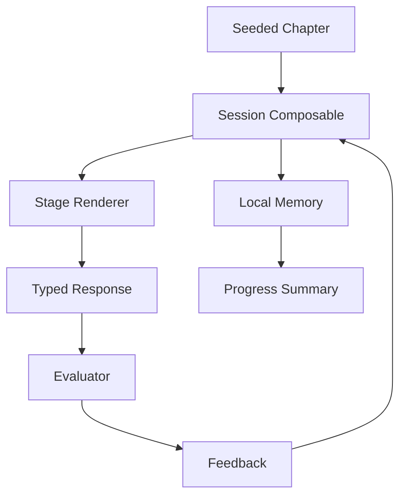

# Requirements

### Overview & Goals
Create a local-first Dutch-learning prototype that demonstrates the product philosophy through one complete, typed-response learning loop rather than a conventional lesson/quiz sequence.

### Scope
#### In scope
- A foundation shell with learner home, chapter entry, active session, completion state, and visible progress summary.
- One seeded B1 capability chapter focused on giving opinions and reasons, using Dutch examples such as `Ik denk dat...`, `Volgens mij...`, and `omdat`.
- Ordered stages: Discover, Understand, Retrieve, Transform, Personalise, Correct/Retry, and a lightweight delayed-review item.
- Deterministic typed-response evaluation with useful correction, an improved answer, and retry behavior.
- Local browser persistence for current stage, attempts, and multidimensional starter metrics.

#### Out of scope
- Authentication, remote database, backend APIs, real AI/LLM integration, speech/audio, human review, and a full A1–B2 curriculum.
- Production-grade CEFR certification or claims of accurate language assessment.
- Spaced-repetition scheduling beyond a local delayed-review placeholder.

### Functional Requirements
- A learner can start or resume the sample chapter and see where they are in the loop.
- Recognition uses contextual examples before production tasks; later tasks reuse earlier concepts without requiring hints.
- Retrieval asks the learner to translate or produce a Dutch response.
- Transformation supports constrained changes such as replacing a reason or adjective.
- Personalisation asks an open typed question and accepts a reasonable learner response.
- Feedback distinguishes correct, acceptable, and needs-retry outcomes, showing the target answer and a concise explanation.
- Progress records attempts by skill dimension, including recognition, meaning, production, and automaticity proxies, and survives refreshes.
- Completion presents the capability practiced, weak areas detected, and the next review item instead of a course-completion percentage.

# Technical Design

### Current Implementation
- The repository is a minimal Nuxt 4/Vue 3 app; `app/app.vue` currently renders only `NuxtRouteAnnouncer` and `NuxtWelcome`.
- `package.json` contains only Nuxt, Vue, and Vue Router, so the implementation should use Nuxt/Vue primitives and avoid introducing a state or UI dependency for this slice.
- There are no existing pages, components, stores, composables, models, content fixtures, or tests; all feature structure will be established by this work.

### Key Decisions
- Use a chapter state machine as the session boundary: a typed chapter definition owns ordered stages, while a session composable owns current stage, response, attempts, and completion.
- Keep content data-driven and deterministic: fixtures define prompts, expected answers, transformations, explanations, and skill tags; the UI does not hardcode progression rules.
- Persist through a browser-only composable backed by `localStorage`, with hydration guards so SSR does not access browser globals.
- Use a small evaluator interface for typed answers now, leaving an adapter seam for future AI evaluation without pretending deterministic matching is conversational intelligence.
- Establish a reusable visual shell with plain scoped CSS and Nuxt components, since the starter has no design system dependency.

### Proposed Changes
- Add typed domain contracts under `app/types/` for `Chapter`, `ChapterStage`, `Exercise`, `Attempt`, `Feedback`, `LearnerMemory`, and skill dimensions.
- Add seeded chapter data under `app/data/` with the B1 opinion/reason capability and representative stage exercises.
- Add a pure evaluator under `app/utils/` that normalizes typed answers, handles exact/accepted variants and transformation targets, and returns feedback plus skill tags.
- Add composables under `app/composables/` for session state-machine transitions and local progress persistence.
- Replace the starter root view in `app/app.vue` with the application shell and add routes for home, chapter/session, and completion/progress views under `app/pages/`.
- Split UI into focused components under `app/components/`: progress header, chapter card, stage renderer, response input, feedback panel, and capability summary.
- Add accessible keyboard-submit behavior, explicit stage progress, retry controls, and empty/reset handling for corrupted or missing local data.

### Data Flow

### File Structure
- `app/app.vue`: replace starter welcome content with the app shell.
- `app/pages/index.vue`: learner home and chapter launch/resume card.
- `app/pages/chapter/[slug].vue`: active chapter state-machine session.
- `app/pages/progress.vue`: local capability and bottleneck summary.
- `app/components/`: reusable session and progress presentation components.
- `app/composables/useChapterSession.ts`: stage transitions, attempts, completion.
- `app/composables/useLearnerMemory.ts`: local persistence and memory updates.
- `app/data/chapters.ts`: seeded B1 chapter fixture.
- `app/types/learning.ts`: shared contracts.
- `app/utils/evaluateResponse.ts`: deterministic response evaluation.
- `app/assets/`: feature styling if needed.

### Risks
- Free-form typed answers have linguistic variation; support normalized accepted variants and clearly label the evaluator as prototype feedback.
- Nuxt SSR hydration can diverge when local progress is read too early; defer browser reads until mounted and render a stable loading state.
- A foundation shell can become over-generalized; keep the first state machine limited to the defined stage types while preserving typed extension points.

# Testing

### Validation Approach
Validate the vertical slice with Nuxt build checks and focused unit/component checks using the project’s available tooling or lightweight pure-function coverage where no test framework exists yet.

### Key Scenarios
- A new learner opens `/`, launches the seeded chapter, advances through each stage, submits typed answers, receives feedback, retries, and reaches completion.
- Refreshing during an active chapter restores the current stage and attempt history from `localStorage`.
- Correct, accepted-variant, and incorrect answers produce distinct feedback and update the relevant memory dimensions.
- Completion displays capability progress and a delayed-review item; the progress page reflects the same persisted state.
- Missing, malformed, or reset local data returns the learner to a safe fresh state without hydration errors.

### Test Changes
- Add unit coverage for answer normalization/evaluation and state-machine transitions.
- Add component or page-level coverage for submit, retry, resume, completion, and progress rendering if a test runner is introduced as part of the implementation.
- Run `pnpm build` to verify Nuxt route generation and production compilation.

# Delivery Steps

### ✓ Step 1: Create learning domain and seeded chapter
The app has typed learning contracts and one data-driven B1 opinion-giving chapter available to the UI.

- Add `app/types/learning.ts` with chapter, stage, exercise, feedback, attempt, and learner-memory contracts.
- Add `app/data/chapters.ts` with Discover, Understand, Retrieve, Transform, Personalise, and review stages.
- Add `app/utils/evaluateResponse.ts` for normalization, accepted answers, transformations, and deterministic feedback.
- Cover evaluator edge cases with focused tests or executable validation.

### ✓ Step 2: Implement local chapter session state
A learner can progress through the seeded chapter with resumable state and persisted skill memory.

- Add `useChapterSession.ts` to model ordered stages, submissions, retries, advancement, and completion.
- Add `useLearnerMemory.ts` with SSR-safe `localStorage` hydration, persistence, reset, and malformed-data recovery.
- Update memory dimensions from attempt outcomes without claiming formal CEFR assessment.
- Verify refresh/resume and completion persistence behavior.

### ✓ Step 3: Build the learning-loop application shell
The Nuxt starter presents a usable home, active chapter session, feedback flow, and progress view.

- Replace `app/app.vue` starter content with navigation and shared layout styling.
- Add `app/pages/index.vue`, `app/pages/chapter/[slug].vue`, and `app/pages/progress.vue`.
- Add focused components for chapter launch, stage rendering, typed response entry, feedback/retry, progress, and completion summary.
- Provide accessible focus states, keyboard submission, stage progress, loading/hydration handling, and responsive styling.

### ✓ Step 4: Validate the vertical slice
The complete local learning loop builds successfully and meets the defined learner scenarios.

- Exercise new session and evaluator behavior through automated checks where supported.
- Manually validate launch, each stage type, correction/retry, refresh resume, reset, and completion/progress flows.
- Run `pnpm build` and address route, type, hydration, or production compilation issues.